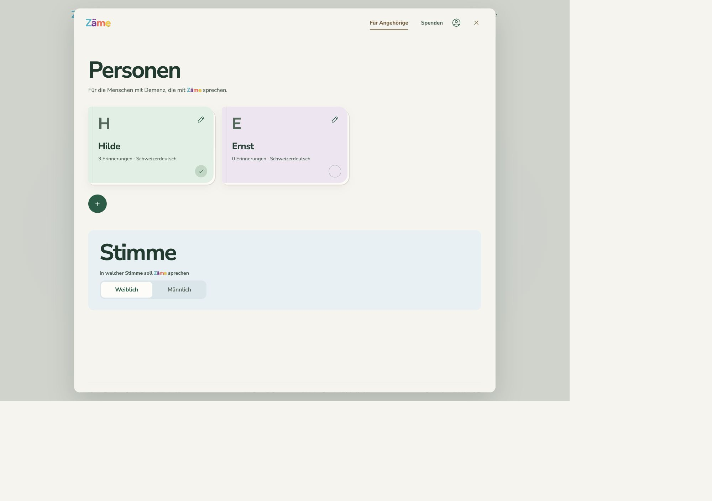
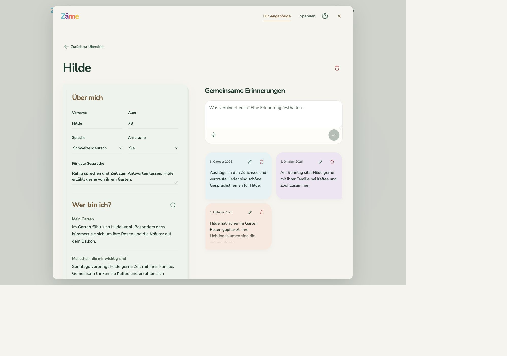

# Zäme

**Ein offenes Projekt für mehr Nähe im Alltag.** 
**An open project for a little more connection in everyday life.**

[Deutsch](#deutsch) · [English](#english) · [Demenzfreundlich Kreis 6](https://demenzfreundlich-kreis6.ch/)

## Deutsch

«Zäme» heisst auf Schweizerdeutsch «zusammen». Die Idee: ein ruhiger Gesprächsbegleiter für Menschen mit Demenz, der an vertraute Geschichten, Lieblingsorte und gemeinsame Erinnerungen anknüpft. Wenige Knöpfe, eine freundliche Stimme und kein Druck, sich an etwas erinnern zu müssen.

Zäme entsteht im Kontext von **[Demenzfreundlich Kreis 6](https://demenzfreundlich-kreis6.ch/)**. Der Code ist frei zugänglich, damit andere mitgestalten und das Projekt selbst betreiben können.

### Wie funktioniert es?

Angehörige legen ein Profil für ihren Menschen mit Demenz an und sammeln kleine Erinnerungen – geschrieben oder eingesprochen. Daraus entsteht unter **«Wer bin ich?»** eine kurze Zusammenfassung, wie in einem Freundschaftsbuch. Neue Erinnerungen werden bewusst per Pfeil-Symbol in die Zusammenfassung übernommen.

Dann eine Stimme wählen, die anwesenden Menschen auswählen und **einmal auf «Sprechen» drücken**. Das Gespräch läuft, bis der Knopf erneut gedrückt wird. Der gesprochene Text erscheint darunter. Mehrere Menschen können dabei sein; Zäme erkennt allerdings nicht automatisch, wer gerade spricht.

Gespräche schreiben **keine neuen Angaben automatisch ins Profil**. Angehörige behalten die Kontrolle darüber, welche Erinnerungen gespeichert werden.

### Kostenlos nutzbar – transparent finanziert

Langfristig soll Zäme für Menschen mit Demenz kostenlos sein. Spenden sollen die laufenden Kosten tragen, mit TWINT und einer offen nachvollziehbaren Budgetübersicht. **Aktuell sind die Spendenzahlen eine Demo; der Zahlungsweg ist noch nicht eingerichtet.**

### Noch ein Prototyp

Zäme ergänzt menschliche Nähe, ersetzt aber keine Angehörigen, Betreuung, medizinischen Rat oder Hilfe im Notfall. Ein gesundheitlicher Nutzen ist nicht belegt. Bitte vorerst **nur mit erfundenen Daten testen**: Vor einem Einsatz mit echten Menschen müssen Einwilligung, Datenschutz und fachlich begleitetes Testen geklärt werden.

## Einblicke / A look inside

### Menschen und Stimmen / People and voices

Für Angehörige: auswählen, wer dabei ist, und eine passende Stimme wählen. 
For care partners: choose who is present and select a voice.

### Wie ein Freundschaftsbuch / Like a friendship book

Was einen Menschen ausmacht, und die gemeinsamen Erinnerungen dahinter. 
What makes someone who they are, and the shared memories behind it.

*Alle Menschen und Erinnerungen in diesen Screenshots sind erfunden. / All people and memories in these screenshots are fictional.*

## English

“Zäme” means “together” in Swiss German. It is an experimental, gentle voice companion for people living with dementia, built around familiar stories, favourite places and shared memories. Few buttons, a friendly voice and no pressure to remember.

Developed in the context of **[Demenzfreundlich Kreis 6](https://demenzfreundlich-kreis6.ch/)**, Zäme is open source so others can contribute and run their own version.

### How it works

Family members and care partners create a profile **for the person living with dementia** and add short memories, by typing or recording a voice note. These become a small friendship book, with a themed summary under **“Wer bin ich?” (“Who am I?”)**. Refreshing that summary is a deliberate action.

Choose a voice, select who is present and **press “Sprechen” once to talk**. Press again to finish. Captions appear below the button. Several people can join, but Zäme does not automatically identify individual speakers.

Conversations **never automatically add facts to profiles**. Care partners decide what is saved.

### Free access is the goal

The aim is free access for people living with dementia, funded through donations covering running costs. TWINT and a transparent budget are planned. **Donation figures are currently demo data; payments are not connected.**

### An early prototype, not a replacement for care

Zäme is intended to complement human connection, not replace family, care, medical advice or emergency help. No clinical benefit has been established. Please **use fictional data for now**. Consent, privacy safeguards and professionally supported evaluation are needed before use with real people.

## Offen und flexibel / Open and flexible

Verschiedene Setups sind möglich, darunter **Modal und Infomaniak** für das KI-Modell. **ElevenLabs** übernimmt die Stimme; ein alternativer Gesprächsmodus bleibt als Fallback erhalten. Die aktuelle Preview verwendet Infomaniak.

Different setups are available, including **Modal and Infomaniak** for the AI model. **ElevenLabs** provides the voice, and an alternative conversation mode remains available as a fallback. The current preview uses Infomaniak.

Profile liegen derzeit lokal im Browser; für KI-Funktionen werden benötigte Inhalte an die eingerichteten Dienste übermittelt. Anmeldung und geräteübergreifende Speicherung fehlen noch. Selbstbetrieb benötigt eigene Dienstzugänge und verursacht laufende Kosten.

Profiles currently stay in the browser; AI features send the necessary content to the configured services. Login and cross-device storage are not yet available. Self-hosting requires your own service credentials and incurs running costs.

## Mitgestalten / Get involved

Feedback von Menschen mit Demenz, Angehörigen, Fachpersonen und Entwickler:innen ist willkommen. Bitte keine persönlichen Betreuungsdaten oder Aufnahmen in öffentlichen Issues teilen.

Feedback from people living with dementia, care partners, professionals and developers is welcome. Please keep personal care data and recordings out of public issues.

[Einrichtung & Entwicklung / Setup & development](docs/DEVELOPMENT.md) · [Sicherheit / Security](SECURITY.md) · [Spenden / Donations](DONATIONS.md) · [MIT licence](LICENSE)

Partnerlogos sind von der Code-Lizenz ausgenommen. / Partner marks are excluded from the code licence: [notice](assets/NOTICE.md).

---

**Mehr Nähe. Weniger Hürden. Zäme.**

[demenzfreundlich-kreis6.ch](https://demenzfreundlich-kreis6.ch/)

