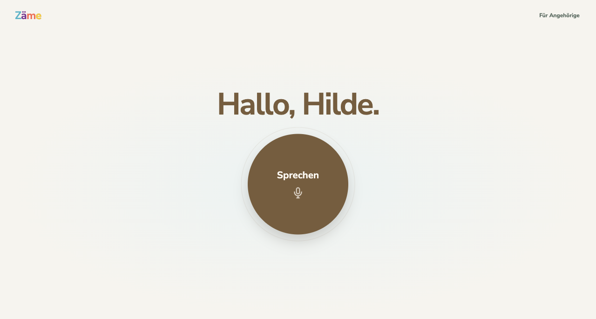
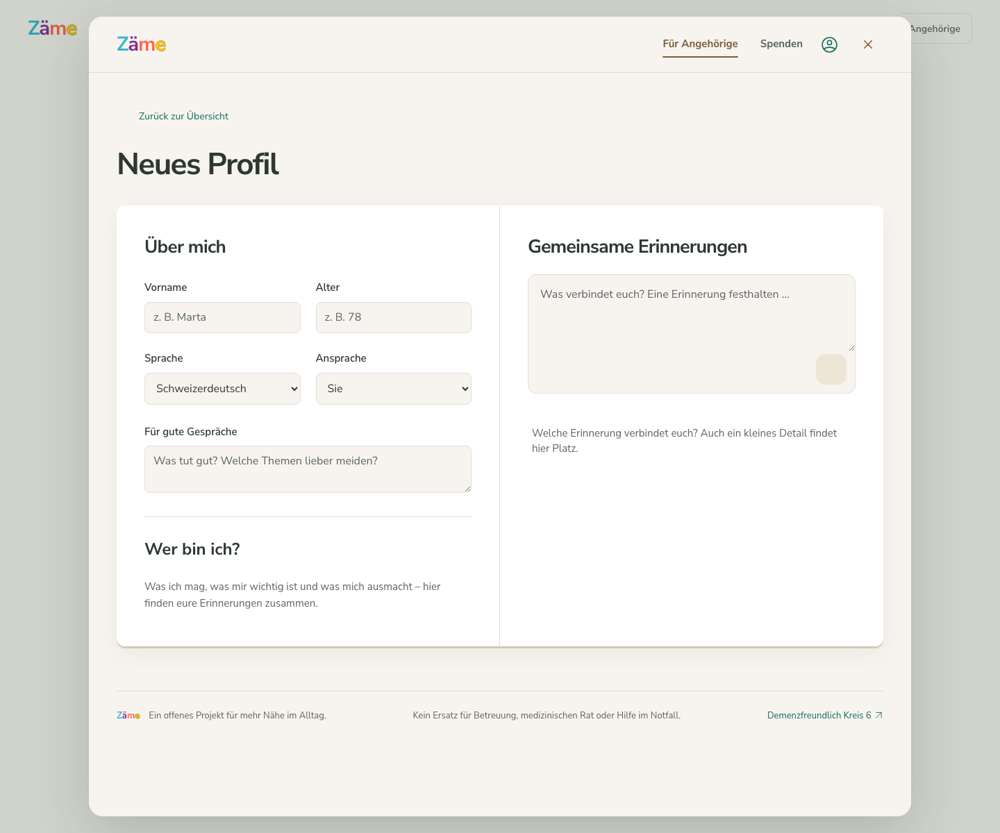
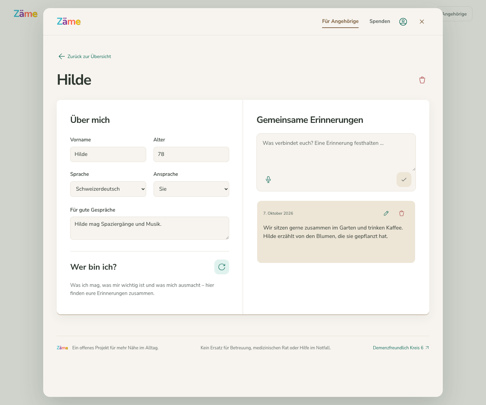
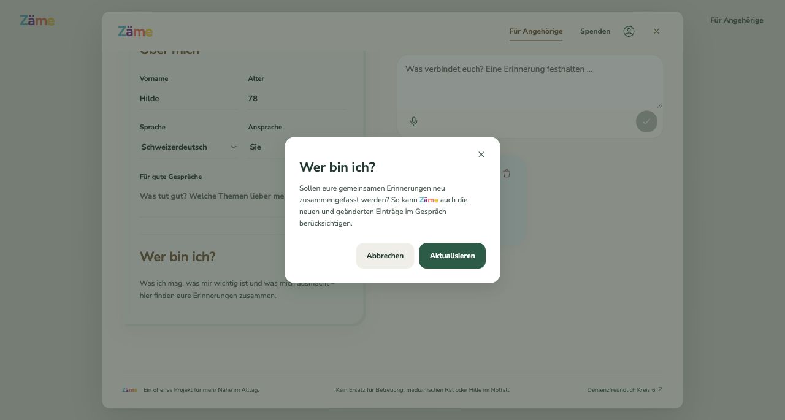
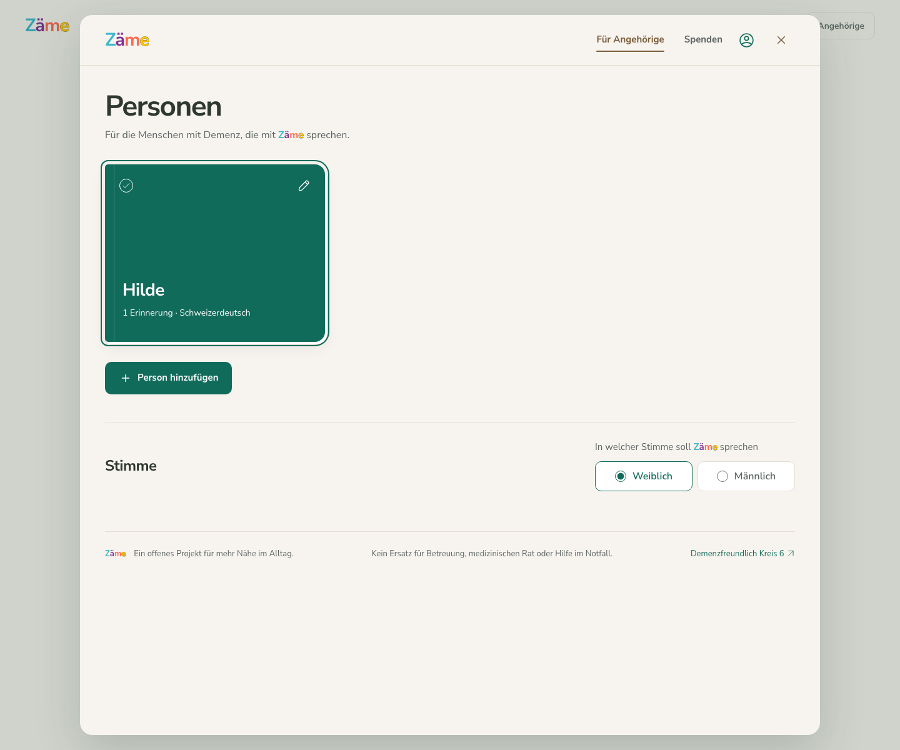

# Zäme

**Vertraute Gesprächsmomente. Ein offener Prototyp von MYNA.** 
**Familiar conversations. An open prototype by MYNA.**

[Deutsch](#deutsch) · [English](#english) · [Testversion](https://demenzfreundlich-kreis6.ch/zaeme/)

> **Stand: 9. Oktober 2026 — geschlossene Testphase, nur auf Einladung.**
> Datenschutz- und Anbieterfragen für einen Einsatz mit echten Personen sind noch offen. Die gehostete App erlaubt ausschliesslich erfundene Profile und Erinnerungen; echte Personenprofile sind serverseitig gesperrt. Ein MYNA-Konto allein gewährt keinen Zugang. Diese Veröffentlichung ist keine Freigabe für den Betreuungs- oder medizinischen Einsatz.
>
> **As of 9 October 2026 — invitation-only testing.** Privacy and provider-contract questions for real-person use remain unresolved. The hosted app permits fictional profiles and memories only; real-person profiles are blocked server-side. A MYNA account alone does not grant access. Publication does not establish suitability for care or medical use.

## Deutsch

«Zäme» bedeutet auf Schweizerdeutsch «zusammen». Die Idee ist ein einfacher KI-Gesprächsbegleiter, der an vertraute Interessen und Erinnerungen anknüpft. Die Gestaltung orientiert sich an den Bedürfnissen von Menschen mit Demenz und ihren Angehörigen. Ein gesundheitlicher Nutzen wurde nicht nachgewiesen.

**MYNA betreibt Zäme eigenständig.** Die Hauptwebsite [Demenzfreundlich Kreis 6](https://demenzfreundlich-kreis6.ch/) wird von der Evangelisch-reformierten Kirchgemeinde Zürich verantwortet. Die gemeinsame Domain bedeutet keine gemeinsame Betreiberverantwortung für die App.

### Aktueller Testbetrieb

- Persönlicher, einmal einlösbarer Einladungslink und bestätigtes MYNA-Login über ZITADEL.
- Erfundene Profile als Freundschaftsbücher, Text-Erinnerungen, auswählbare Teilnehmende und Stimmen.
- Gesonderte, versionierte Buchfreigabe und Annahme der Nutzungsbedingungen vor der Erfassung; erneute Information und Bestätigung vor jedem Gespräch.
- KI-Zusammenfassungen werden erst nach menschlicher Prüfung übernommen. Gespräche schreiben keine Angaben automatisch in Bücher.
- Mehrere Teilnehmende sind möglich; die KI erkennt nicht zuverlässig, wer gerade spricht.
- Bücher bleiben unverschlüsselt im jeweiligen Browser. Keine geräteübergreifende Synchronisierung. Für KI-Funktionen werden ausgewählte Inhalte an die eingerichteten Anbieter übermittelt.
- Kein angesammeltes Zeitkontingent und keine Personenquote für freigeschaltete Konten. Einzelne Gespräche enden spätestens nach zehn Minuten; Budget- und technische Grenzen bleiben bestehen.
- Sprachnotizen und alternative Sprachschnittstellen sind in der gehosteten App deaktiviert. Spendenzahlen sind als Demo gekennzeichnet; Zahlungen sind nicht angebunden.

Auch mit erfundenen Büchern werden echte Stimmen, Kontodaten und technische Daten verarbeitet. Bitte keine Gesundheitsdaten, vertraulichen Angaben oder Informationen über unbeteiligte Personen eingeben oder aussprechen. Zäme ersetzt weder menschliche Begleitung noch medizinischen Rat oder Notfallhilfe. KI-Antworten können falsch oder belastend sein.

### Technik und nächste Schritte

App und selbst betriebener ZITADEL-Login laufen bei **Infomaniak in der Schweiz**. Aktuell übernimmt **ElevenLabs Agents** Gesprächssteuerung, Spracherkennung und Sprachausgabe; das angebundene Sprachmodell läuft bei **Infomaniak AI Services**. Die gesamte Verarbeitung ist dadurch **nicht ausschliesslich schweizerisch**.

Vor einer Öffnung für echte Profile müssen Anbieterbedingungen, Auftragsbearbeitung, Auslandtransfers, Einwilligung beziehungsweise Vertretung und Datenschutzrisiken dokumentiert geklärt werden. Neben ElevenLabs müssen für eine spätere Weiterentwicklung auch **andere Sprach- und Agentenlösungen** auf Datenschutz, Speicherorte, Löschbarkeit, Vertragsbedingungen und Qualität evaluiert werden. Ein Anbieterwechsel ist noch nicht umgesetzt oder entschieden.

Das Projekt bleibt vorerst auf diesem Teststand; es gibt keinen zugesagten Termin für eine öffentliche Freigabe und keine laufende Weiterentwicklungszusage. Ein erreichbarer Testdienst benötigt weiterhin Sicherheitsupdates, Kostenkontrolle und die Bearbeitung von Löschanfragen. [Betriebsstand und offene Punkte](docs/PROJECT-STATUS.md).

## Ein Blick in die Oberfläche / Interface examples

Die folgenden Ansichten zeigen die Gestaltung anhand **erfundener Daten**. Anmeldung, Einladung und Freigaben sind zusätzliche Schritte; die Bilder sind keine vollständige Anleitung für den aktuellen Testzugang.

## English

“Zäme” means “together” in Swiss German. This prototype explores a simple AI conversation companion built around familiar interests and memories, with an interface designed with people living with dementia and care partners in mind. No clinical benefit has been established.

**MYNA operates Zäme independently.** The main Demenzfreundlich Kreis 6 website is the responsibility of the Evangelisch-reformierte Kirchgemeinde Zürich.

The hosted test requires a single-use invitation and verified ZITADEL login. Use fictional friendship books and text memories only. Book collection requires versioned consent and separate acceptance of the terms; each conversation requires fresh participant notice and confirmation. AI summaries need human review. Conversations never automatically update profiles. Several participants can join, but speaker identification is not reliable.

Books remain unencrypted in the current browser without device synchronization. Selected content is sent to the configured providers for AI functions. Voice notes and alternative voice routes are disabled in the hosted app. Calls have a ten-minute technical maximum; shared budgets and abuse controls apply. Donation figures are demos and payments are not connected.

App hosting and self-hosted ZITADEL authentication are in Switzerland with Infomaniak. ElevenLabs currently handles conversation orchestration, speech recognition and synthesis, with Infomaniak AI Services supplying the language model. **The complete processing chain is not Swiss-only.** Even fictional-profile testing processes real voices, account details and technical data.

Privacy, provider agreements, international transfers, valid consent or representation and risk assessment must be resolved before real-person use. **Alternatives to ElevenLabs must also be evaluated** for any future development; no replacement has been selected or implemented. The project is staying at this test stage for now, with no committed public-release date or ongoing development promise. Live operation still requires security maintenance and handling of privacy requests.

Zäme does not replace human care, medical advice or emergency services. Do not submit health information, confidential material or third-party personal data. AI replies can be inaccurate or distressing.

## Code, feedback and self-hosting

The source is public under the [MIT licence](LICENSE). It includes private-development adapters that are **not** authorised hosted access paths. Self-hosting requires your own credentials, operating budget, access controls and legal assessment; the code licence does not grant access to MYNA infrastructure or third-party services.

Please do not share personal profiles, recordings, credentials or private invitation links in public issues. Report vulnerabilities privately to **info@myna-ai.ch**. Project feedback is welcome; a response or implementation is not guaranteed.

[Development](docs/DEVELOPMENT.md) · [Current status](docs/PROJECT-STATUS.md) · [Security](SECURITY.md) · [Impressum](https://demenzfreundlich-kreis6.ch/zaeme/impressum) · [Datenschutz](https://demenzfreundlich-kreis6.ch/zaeme/datenschutz) · [Nutzungsbedingungen](https://demenzfreundlich-kreis6.ch/zaeme/nutzungsbedingungen) · [Donation demo](DONATIONS.md)

Partner marks are excluded from the code licence: [asset notice](assets/NOTICE.md). Icons: [Iconoir MIT licence](icons/LICENSE). Font: [Nunito Sans licence](fonts/LICENSE.txt).
